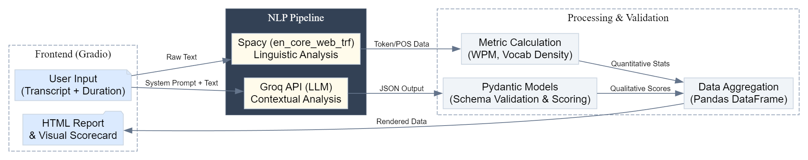

# 🎤 AI Speech Coach: Intelligent Speaking Evaluation System

 tool designed to democratize public speaking coaching. Unlike simple WPM counters, this system leverages **Large Language Models (LLMs)** and **Transformer-based NLP pipelines** to provide a holistic evaluation of a speech.

It analyzes content structure, grammatical precision, vocabulary richness, and emotional engagement to generate professional, actionable feedback reports.

## 🏗️ System Architecture

The application follows a modular architecture, separating the presentation layer (Gradio) from the analysis logic (Spacy/Groq).



## 🚀 Key Technical Features

### 1\. Hybrid NLP Pipeline

The system utilizes a dual-engine approach for maximum accuracy:

  * **Spacy (`en_core_web_trf`):** A transformer-based pipeline is used for deterministic linguistic tasks (Tokenization, Filler word detection, Vocabulary density).
  * **Groq API (LLM):** Handles high-level cognitive tasks such as Sentiment Analysis, Structural Flow evaluation, and Context-aware Grammar correction.

### 2\. Robust Data Validation (Pydantic)

The application enforces strict schema validation using **Pydantic**.

  * Ensures the LLM outputs structured JSON data (not hallucinations).
  * Uses `computed_fields` to automatically derive scores from raw data, ensuring mathematical consistency across the rubric.

### 3\. Automated Reporting

Generates a self-contained, CSS-styled HTML report that visualizes the breakdown of:

  * **Content Mastery:** Salutation, Introduction, and Conclusion flow.
  * **Linguistic Precision:** Grammar error correction with "Wrong vs. Right" comparisons.
  * **Engagement Metrics:** Tone analysis and positivity probability.

## 📊 Scoring Algorithm

The scoring engine aggregates 100 points across 5 weighted dimensions:

| Category | Weight | Logic |
| :--- | :--- | :--- |
| **Content Structure** | **30%** | Evaluates the logical progression (Intro $\to$ Body $\to$ Outro) and extraction of key persona details. |
| **Language & Grammar** | **20%** | Penalties applied for grammatical errors detected by the LLM; rewards for high Type-Token Ratio (TTR). |
| **Clarity (Fillers)** | **15%** | Inverse scoring based on the frequency of hesitation markers (*"um", "uh", "like"*). |
| **Engagement** | **15%** | Sentiment analysis probability score (Positive tone \> 0.9 confidence = Max score). |
| **Speech Rate** | **10%** | Gaussian-style scoring centering around the ideal range of **111-140 WPM**. |

*Note: Scores are normalized to integer values to ensure readability.*

## 🛠️ Tech Stack

  * **Language:** Python 3.9+
  * **Interface:** Gradio (Rapid prototyping UI)
  * **LLM Serving:** Groq Cloud API (Low latency inference)
  * **NLP:** Spacy (Transformer pipeline)
  * **Data Engineering:** Pandas (Dataframe manipulation), Pydantic (Schema validation)
  * **Utilities:** Regular Expressions (Regex)

## 💻 Installation & Setup

### Prerequisites

  * Python 3.9 or higher
  * A Groq API Key (Available at [console.groq.com](https://console.groq.com))

### Step 1: Clone Repository

```bash
git clone https://github.com/your-username/ai-speech-coach.git
cd ai-speech-coach
```

### Step 2: Configure Environment

It is recommended to use a virtual environment.

```bash
# Windows
python -m venv venv
venv\Scripts\activate

# Mac/Linux
source venv/bin/activate
```

### Step 3: Install Dependencies

```bash
pip install -r requirements.txt
```

### Step 4: Download NLP Models

This project uses the accuracy-focused transformer model for Spacy. **Note:** The `--direct` flag is essential for correct local installation.

```bash
python -m spacy download en_core_web_trf --direct
```

### Step 5: Run Application

```bash
python app.py
```

*The application will launch locally at `http://127.0.0.1:7860`*

## 📂 Project Structure

```text
AI-Speech-Coach/
├── app.py                  
├── requirements.txt        
├── README.md                
├── architecture_diagram.png 
└── outputs/                 
```

## ⚖️ Design Decisions & Trade-offs

* **Spacy TRF vs. Light Models:** I chose the `en_core_web_trf` (Transformer) pipeline over lighter models (`en_core_web_sm`) to maximize Part-of-Speech (POS) tagging accuracy. While this increases memory usage, it ensures the "Word Count" and "Filler Word" detection is robust against complex sentence structures.
* **Deterministic vs. Generative Scoring:** The scoring logic uses `Pydantic` validation to force the LLM into a strict schema. This decision was made to prevent "hallucinated" scores. If the LLM fails to return a valid JSON, the system fails gracefully rather than outputting a random number.
* **Groq vs. Standard APIs:** Groq was selected for the inference engine due to its superior tokens-per-second (TPS) performance, which is critical for maintaining a responsive user experience in a real-time feedback tool.
